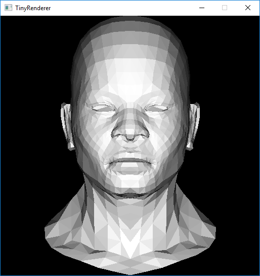
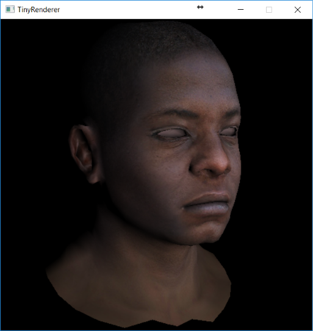

# TinyRenderer

* License: [MIT](https://mit-license.org/) © [Lu Yiming](https://github.com/luyiming)

* Platform: Windows/Linux

# Screenshots



# Building Source

## Prerequisites

The following libraries are required to build:

- [SDL2.0](https://www.libsdl.org/download-2.0.php)
- [SDL_image](https://www.libsdl.org/projects/SDL_image/)
- [SDL_mixer](https://www.libsdl.org/projects/SDL_mixer/)
- [OpenGL](https://www.opengl.org/)

Please make sure that all dependancies are installed and linked properly to your PATH before building.

### Windows
SDL2.0-related libraries have already been prepared in the `lib/` folder. If you like, you can replace them with the newest files from [SDL2.0](https://www.libsdl.org/download-2.0.php).

### Linux
If you use Debian/Ubuntu, simply cut'n paste:
```
sudo apt-get install libsdl2-dev libsdl2_image-dev libsdl2_mixer-dev
```

## Build Instructions

### Linux
```bash
mkdir build
cd build
cmake .. # You can switch to other build systems, see cmake manual
make     # the default build system on Linux is "Unix Makefiles"
./TinyRenderer # run the game
```

### Windows
```bash
mkdir build
cd build
cmake .. # the default build system on Windows is Visual Studio
```
Open `TinyRenderer.sln` file in `build/` folder. You can then build and run the project in Visual Studio. The executable file should be in `build/Debug`.
